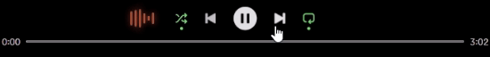

<h1 align="center">💫 Dynamic Island Visualizer </h1>
<p align="center">
  <b>If you want beautiful, compact visualizer - that's it</b>!<br/>
  <i>Beautiful and compact!</i>


## Plugin's demo
<div align="center">
  
  <p><i>The visualizer in sync with the beat</i></p>
</div>


## Short description
*Dynamic-Island-Visualizer* - **a sleek, minimalist, and high-performance audio-reactive visualizer for Spotoify (with installed Spicetify), inspired by the iPhone's Dynamic Island call interface.**

---

##  Key Features

* **Adaptive Color Engine**: Uses a robust Dribbblish-Dynamic style canvas extraction method to grab colors directly from album art. It bypasses broken APIs and includes a "darkness check" to ensure visibility on all tracks.
* **Pro Physics Engine**: Features **Asymmetric Physics** with a snappy "Fast Attack" (upward movement) and a smooth, gravity-based "Decay" (downward movement).
* **Rhythmic Beat-Sync**: Taps into Spotify's internal `AudioAnalysis` to pulse in sync with the song's actual beats, tatums, and loudness segments.
* **Zero-Dependency**: Works perfectly on vanilla Spotify (but you need Spicetify installed, srry). No specific themes or external CSS frameworks required.

---

##  Installation

> ⚠️ **IMPORTANT**  
Install Spicetify:

**First at first install Spicetify from [there](https://spicetify.app/docs/getting-started)**

2. *Download the [dynamicViz.js](https://raw.githubusercontent.com/H4zeyaf/Dynamic-Island-Visualizer/refs/heads/main/dynamicViz.js) file and place it in your Spicetify Extensions folder:*

* **Windows**: `%AppData%\Spicetify\Extensions\`
* **macOS/Linux**: `~/.spicetify/Extensions/`

### 2. Enable the extension
Open your `Terminal` or `PowerShell` (`Win + r` -> `powershell`) and run the following commands:

```powershell
spicetify config extensions dynamicViz.js
spicetify apply
```
---
##  Credits & Acknowledgements

* **UI Design**: Inspired by the Apple **Dynamic Island** interface.
* **Color Logic**: This extension uses a modified version of the Canvas Extractor class from **[Dribbblish Dynamic](https://github.com/JulienMaille/dribbblish-dynamic-theme)**. Huge thanks to **Julien Maille** and the contributors of that project for their robust approach to color sourcing in Spotify.

---

##  License
This project is open-source. If you use the color extraction logic in your own projects, please continue to credit the original Dribbblish Dynamic authors.
